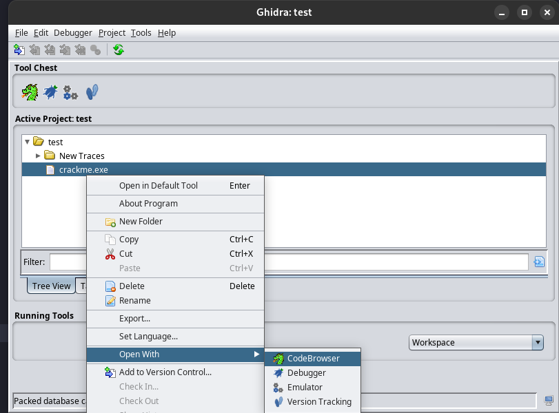
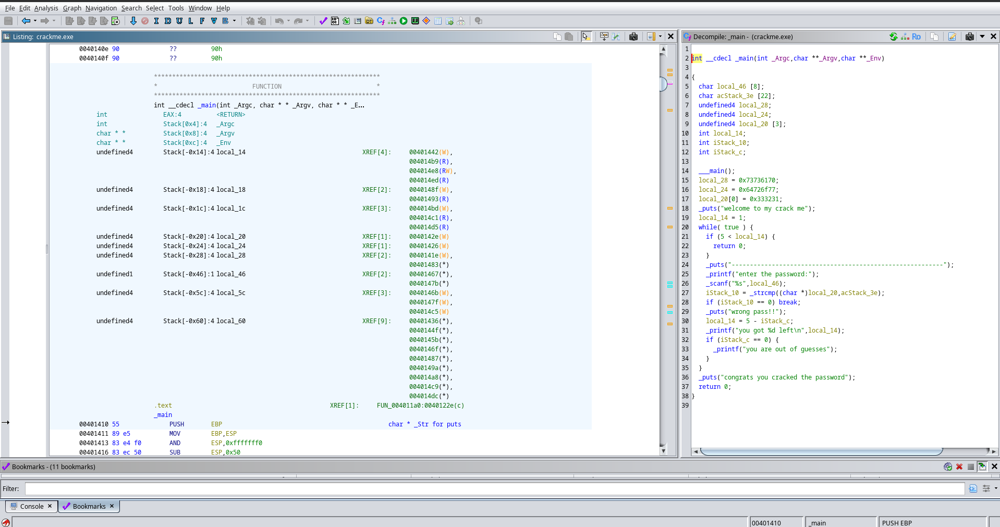
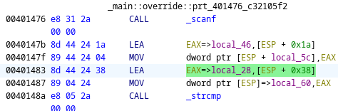
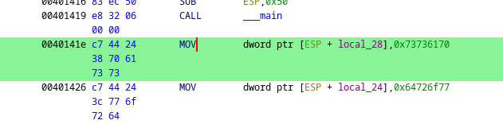
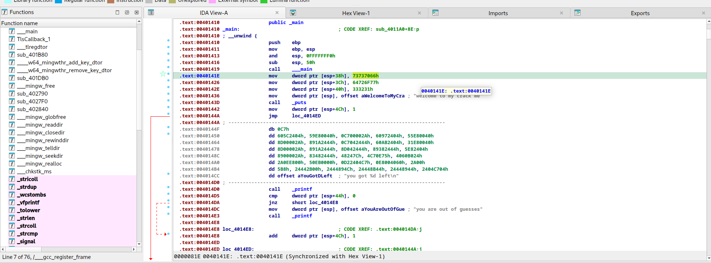
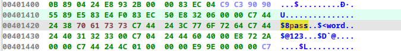

# Как найти пароль в файле?

# ПАРОЛЬ ОТ ФАЙЛА "crackmes.one"

## Решение для x64dbg или IDAfree на Windows [тут](https://reverse-the-planet.blogspot.com/2022/03/mohammadali-very-easy-very-simple-c-code.html)

## Решение для Linux

#### Что установить

1. Поставить wine, потому что файл скомпилен под винду

2. Поставить IDAfree с VPN

3. Поставить Ghidra

#### Что делать

Запускаем ghidra

Создаём новый проект

Добавляем в него файлик crackme.exe

Жмаем пкм > open with > code browser 

Когда предлагает проанализировать файл, нажимаем анализировать, видим что-то типа

Справа видим код, в нём есть scanf - считывание строки, есть strcmp - сравнение оной с чем-то

Нас интересует то, с чем оно сравнивает - это токен local28, который был проинициализировань чуть ранее

Видим адрес 0x73736170

Открываем crackme.exe в IDAfree

**ВЫБИРАЕМ АНАЛИЗ И ДЕКОМПИЛЯЦИЮ 8086**

находим +- то же место, клацаем на адрес

Заходим в hex view и видим пароль, раздробленный на разные кусочки

password123
